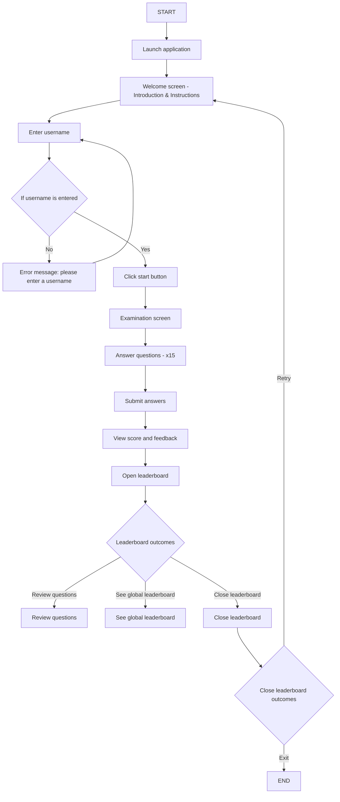

<h1 align="center">TechQuest: Knowledge Challenge</h1>

My VB.NET school assignment, a simple examination system.

## Table of Contents
- [Notes](#notes)
- [Flowchart](#flowchart)
- [Download](#download)

## Notes
- Please ignore yucky code, it just works.
	- There is (hopefully) enough comments in the code to understand what's going on. I will NOT bother re-checking as my brain will explode from seeing my unformatted, unclean mess.

## Flowchart

## Download
You can download a **compiled release** from [here](https://github.com/NoobToolzz/TechQuest/releases/latest/download/TechQuest-compiled.zip).